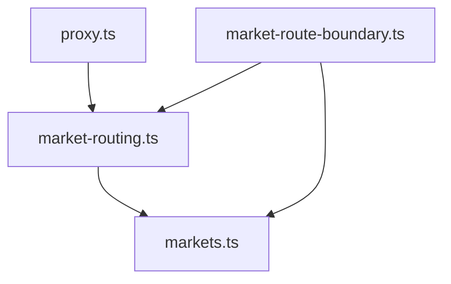

# GER-WEB-003B — Germany Market Child Route Foundation

## 1. Previous Limitation
The initial Germany routing architecture (GER-WEB-003) only resolved the entry route (`/de`) and language root routes (`/de/[language]`). It discarded deeper path segments entirely and returned `undefined`, making it impossible to support child routes like `/de/de/trial`.

## 2. New Route Model
The `MarketRoute` contract has been extended with a `kind: 'child'` and a `childSegments` array. Child routes are structurally recognized and parsed, independently of whether there is actual React UI implemented for them yet.

## 3. Route Resolution Structure
- `resolveMarketRoute` extracts the first segment as the `language` and any remaining segments as `childSegments`.
- If `childSegments` exists and is non-empty, the route `kind` is classified as `'child'`.

## 4. Child-Route Generation
A new routing utility `getMarketChildPath(market, language, childSegments)` generates structurally correct paths (e.g., `/de/de/trial`).

## 5. Invalid Route Behavior
- Unknown/unsupported languages inside a market (e.g., `/de/fr/trial`) immediately return `undefined` and throw errors in helpers, avoiding polluted state.
- In `src/app/de/[[...marketSegments]]/page.tsx`, unrecognized or unsupported child routes (i.e. all child routes in this unit, since no UI exists) explicitly trigger `notFound()`. This ensures the catch-all does not silently render empty screens for unknown URLs.

## 6. Disabled-Market Behavior
Germany remains disabled (`enabled: false`). The `requireMarketRoute` boundary correctly halts all child-route execution immediately, resulting in 404s before any UI rendering occurs, preserving the disabled posture.

## 7. App Router Approach
The catch-all page `src/app/de/[[...marketSegments]]/page.tsx` now enforces a `notFound()` on all `kind === 'child'` routes. When future specific routes (like `/de/[language]/trial/page.tsx`) are created, they will naturally intercept the requests before this catch-all handles them. This is the lowest-risk approach for Next.js App Router as it requires no manual catch-all delegation.

## 8. Proxy Behavior
`src/proxy.ts` required no changes. It correctly bypasses global `next-intl` handling for any route starting with `/de/`, preserving structural integrity for deep routes automatically.

## 9. Tests
Focused tests were expanded:
- Prove unsupported languages (e.g. `fr`) are rejected structurally.
- Prove `/de/[language]/trial` correctly generates a `kind: 'child'` route.
- Prove an enabled fixture safely rejects invalid languages and child routes, avoiding silent catch-all rendering.

## 10. Regression Protection
Global next-intl locales (`/en`, `/ar`, `/fr`) are unchanged. Tests prove that `isReservedMarketPathname` behaves predictably, leaving global routing unaffected.

## 11. Dependency Graph

Dependencies remain strictly acyclic, with pure routing separated from UI components.

## 12. Future /trial Usage
When GER-WEB-004 configures localization, we will be able to construct a safe `src/app/de/[language]/trial/page.tsx` layout that natively leverages this foundation.

## 13. Non-goals
- No UI components or forms were implemented.
- No translated messages were introduced.
- Germany remains disabled.
