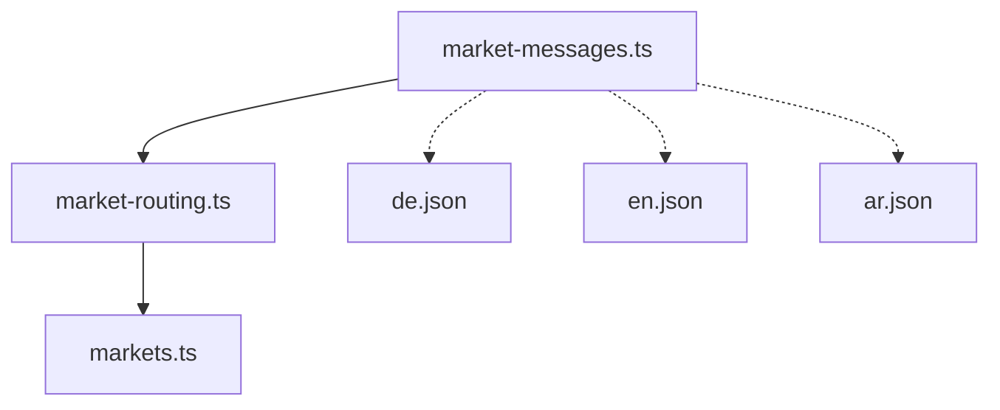

# GER-WEB-004 — Germany Market-Scoped Localization Foundation

## 1. Localization Architecture
The Germany localization foundation establishes an isolated, market-scoped abstraction for serving UI translations. It avoids mutating the global `next-intl` registry so that German does not unexpectedly activate across the entire global North America application.

## 2. Directory Structure
Market-scoped messages are stored cleanly apart from global messages to prevent accidental glob/import leakage.
```
messages/
├── en.json (GLOBAL)
├── ar.json (GLOBAL)
└── markets/
    └── germany/
        ├── en.json (Market)
        ├── de.json (Market)
        └── ar.json (Market)
```

## 3. Global vs Market Locales
- **Global Locales:** `en`, `ar` (Managed strictly by `src/i18n/routing.ts` and `next-intl`).
- **Germany Locales:** `de`, `en`, `ar` (Resolved structurally by `market-routing.ts` and verified strictly through isolated tests).
- `isSupportedLocale('de')` returns `false` inside the global evaluation, explicitly confirming that the Germany configuration is safely partitioned.

## 4. Message Resolution
Components will use the `getMarketMessages(marketId, language)` abstraction located in `src/lib/market-messages.ts`.
- `Germany + de` → Returns `messages/markets/germany/de.json`
- `Germany + en` → Returns `messages/markets/germany/en.json`
- `Germany + ar` → Returns `messages/markets/germany/ar.json`
- Any unsupported locale requested triggers a deterministic `RangeError` fallback-block, preventing silent unmapped state.

## 5. Message Schema
All three dictionary files strictly adhere to identical recursive key shapes, guaranteeing parity. The initial foundation includes keys for future UI features without excessive marketing payload:
- `common`: Generic controls (`continue`, `back`, `submit`).
- `navigation`: Core shell routing layout labels.
- `hero`: Shared semantic entry context ("What would you like help with?").
- `services`: Service display aliases.
- `trust`, `useCases`, `teacherQuality`, `howItWorks`: Layout titles.
- `leadJourney`: Progressive step tracking copy.
- `testimonials`, `faq`, `contact`, `footer`, `errors`, `success`.

## 6. Fallback Policy
**Strict Deterministic Failures.** There is no silent fallback allowing English labels to fill in missing German translations in production runtime unless explicitly configured per-key. Tests dynamically enforce strict parity between `en.json`, `de.json`, and `ar.json` to flag missing translations at compilation/CI.

## 7. RTL Behavior
Arabic (`ar`) leverages existing helpers to correctly emit `rtl` layouts. The `market-routing.ts` utility `getMarketLanguageDirection` returns:
- `ar` -> `rtl`
- `de`, `en` -> `ltr`

## 8. Service Label Localization
Service options (German, English, Arabic, French) are assigned discrete keys under `services` namespace, allowing UI controls to fetch distinct localized display labels decoupled from the interface layout locale itself.

## 9. Tests
Focused tests include:
1. Valid loading of `de`, `en`, and `ar` Germany messages.
2. Complete schema parity (keys match exactly).
3. `RTL` vs `LTR` validation across the locales.
4. Deterministic rejection of unsupported locale `fr`.
5. Global routing preservation (assuring `de` has not infiltrated the global configuration arrays).
6. Prior routing tests expanded to confirm `messages/markets/germany` directory logic.

## 10. Dependency Graph

The design isolates JSON loading from `routing.ts` preventing circular dependencies.

## 11. Non-Goals
- No UI components or forms were implemented in this unit.
- Germany remains disabled in MarketConfig.
- North America English is not reused mechanically to avoid false assumptions; pure Germany market structures are built instead.
- French global routes (`/fr`) were not altered.

## 12. Future UI Usage
Future shared components (e.g., `SharedHeroLeadJourney`) will fetch `getMarketMessages('germany', locale)` and pass the typed response as neutral props, preventing the need for monolithic components like `GermanHero` or `ArabicHero`.
