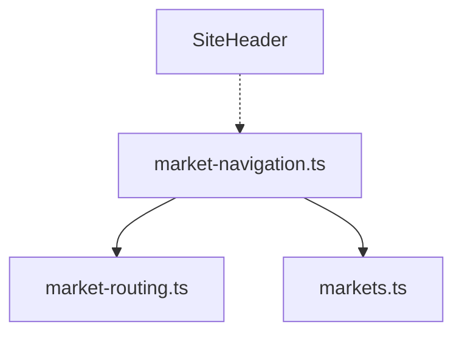

# GER-WEB-005 — Market / Language Navigation Infrastructure

## 1. Purpose
This unit establishes the routing and navigation logic required to build market-aware header dropdowns (language and market switchers). It provides a clean, domain-driven API that isolates UI components from URL string manipulation.

## 2. Navigation Architecture
The infrastructure introduces `NavigationContext`, an abstraction over the raw pathname. UI components will use:
- `parseNavigationContext(pathname)` to extract the current market, locale, and structural segments.
- `getLanguageNavigationOptions(context)` to generate language switcher links.
- `getMarketNavigationOptions(context)` to generate market switcher links.

## 3. North America Locale Switching
North America serves as the global root. The URL layout mirrors `next-intl` global defaults (`/en`, `/ar`, `/en/about`).
Language switching directly preserves valid child segments.
Example: `/en/contact` → `/ar/contact`.

## 4. Germany Locale Switching
Germany leverages its isolated market slug (`/de`). Switching languages dynamically preserves the slug and modifies the trailing locale.
Example: `/de/de` → `/de/en`.
Invalid locales (e.g. `fr`) are deterministically rejected with a `RangeError`.

## 5. Child Path Preservation
The navigation logic utilizes `getMarketChildPath` to retain sub-routes during language switching.
Example: `/de/en/trial` → `ar` → `/de/ar/trial`.
No form states or PII query params are embedded in the base navigational abstraction.

## 6. Market Switching
Switching markets defaults to the target market's `publicSlug` and `defaultLanguage`.
- North America → Germany: `/de/de`
- Germany → North America: `/en`
Cross-market child path mappings are avoided to prevent routing failures on market-specific pages unless mapped explicitly in the future.

## 7. Disabled-Market Behavior
The `getMarketNavigationOptions` helper returns an `isEnabled` boolean matching `MarketConfig`. Germany remains disabled (`isEnabled: false`), allowing the future Header UI to hide the Germany option from public production traffic.

## 8. French Programme Boundary
The `/fr` programme is detected separately. `isFrenchProgramme` flags this route to prevent erroneous language switching options. Calling language switch logic while on `/fr` explicitly throws an error.

## 9. Localization Integration
Display labels for the language switcher (`Deutsch`, `English`, `العربية`) are currently provided directly by the infrastructure module as they are globally static navigation values. No global UI locales were added, preserving strict boundaries.

## 10. RTL Metadata
`LanguageNavigationOption` exposes `direction: 'ltr' | 'rtl'`, allowing the future layout shell to predictably switch directionality upon navigation without redundant logic.

## 11. Header Readiness Contract
UI-WEB-004 is now unblocked. The Header should rely entirely on `NavigationContext` and the provided options arrays (`LanguageNavigationOption[]` and `MarketNavigationOption[]`). It should not parse URLs.

## 12. Tests
Focused tests in `tests/market-navigation.test.mjs` verify:
- Context extraction for all markets.
- Correct destination path generation.
- Rejection of invalid locales.
- Adherence to the `enabled` configuration for market exposure.

## 13. Dependency Graph

## 14. Non-Goals
- No UI components or visual shells were modified or created.
- `next-intl` configuration and global routing remain untouched.

## 15. UI-WEB-004 Handoff
The visual redesign of the Header to incorporate the language and market selectors may now begin using this deterministic infrastructure.
