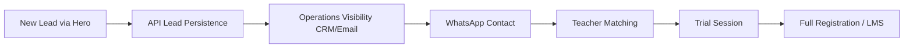

# UI-WEB-002 — Lead Data Contract

## 1. API Request Payload (`POST /api/leads`)
This is the unified data structure sent from the `SharedHeroLeadJourney` to the backend.

| Field | Type | Required | Notes |
|---|---|---|---|
| `market` | String | Yes | `germany` or `na` |
| `locale` | String | Yes | `de`, `en`, `ar` |
| `selectedService` | String | Yes | E.g., `french`, `german` |
| `learnerType` | String | Yes | `child`, `student`, `adult` |
| `learnerAge` | Number | Conditional | Required if child/student |
| `grade` | String | Conditional | Required if child/student |
| `goal` | String | Yes | E.g., `improve_grades` |
| `customerName` | String | Yes | PII - Sanitized text |
| `phone` | String | Yes | PII - Normalized E.164 |
| `email` | String | Yes | PII - Validated email |
| `consent` | Boolean | Yes | Must be true |
| `source` | String | Yes | `hero_journey` |
| `utmSource` | String | Optional | First-touch attribution |
| `utmMedium` | String | Optional | First-touch attribution |
| `utmCampaign` | String | Optional | First-touch attribution |
| `landingPage` | String | Optional | Origin page |
| `sessionId` | String | Yes | For linking analytics |
| `timestamp` | ISO String | Yes | Client submission time |

## 2. API Response Contract
**Success (201 Created)**
```json
{
  "leadId": "ld_123456789",
  "status": "pending_coordination",
  "createdAt": "2026-09-08T12:00:00Z",
  "nextAction": "operations_contact"
}
```

**Error Categories:**
- `VALIDATION_ERROR` (400)
- `DUPLICATE_LEAD` (409)
- `RATE_LIMITED` (429)
- `SERVER_ERROR` (500)

## 3. Lead vs Full Registration Boundary
| Domain | Lead Data | Registration Data (Later) |
|---|---|---|
| **Identity** | Name, Phone, Email | Uses existing approved registration workflow (may collect additional data required for enrollment/account setup) |
| **Academic** | Age, Grade, Goal, Service | Uses existing approved registration workflow |
| **Financial** | None | Uses existing approved registration workflow |

## 4. Operations Handoff Payload
The CRM (or email fallback) requires:
- Lead ID, Name, Phone, Email.
- "Requested [Service] for [LearnerType] (Age: [Age]). Goal: [Goal]."
- Market and Locale (to route to correct bilingual coordinator).
- Source and UTMs (for marketing ROI).

## 5. Lifecycle Diagram


