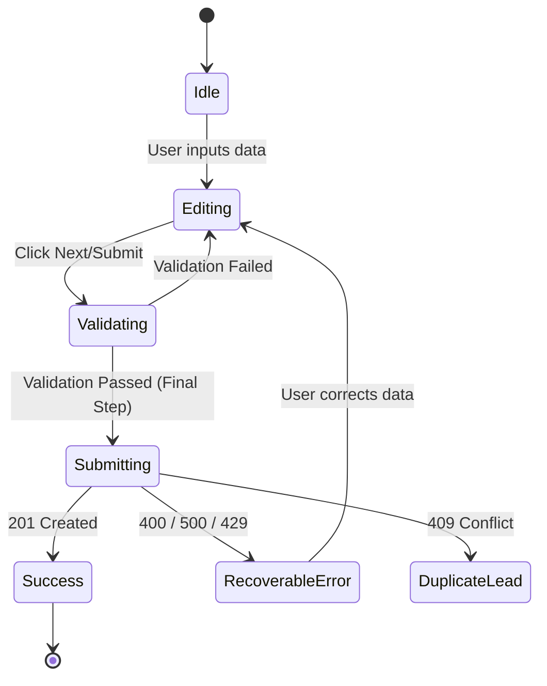

# UI-WEB-002 — UI State Machine

## 1. Submission State Model
The frontend handles strict states to ensure data integrity and prevent false success screens.

### States:
- `IDLE`: User is actively filling out the form.
- `EDITING`: User has interacted with fields.
- `VALIDATING`: Validating constraints before moving to next step or submitting.
- `SUBMITTING`: HTTP request in flight. CTA is disabled with a loading indicator.
- `SUCCESS`: Backend explicitly returned 201 Created. Renders confirmation UI.
- `RECOVERABLE_ERROR`: Backend returned 400 (Validation) or 429 (Rate Limit). Allows user to fix data and resubmit.
- `DUPLICATE_OR_EXISTING_LEAD`: Backend indicates lead exists. Inform user they will be contacted soon.

## 2. State Machine Diagram

## 3. Persistence & Recovery
- **Browser Back:** Preserves form state via `sessionStorage` or React state (if SPA navigation).
- **Accidental Refresh:** Form state ideally recovered from `sessionStorage` (except PII if security dictates).
- **Abandonment:** Analytics triggers `lead_submit_failed` or `lead_abandoned`.
