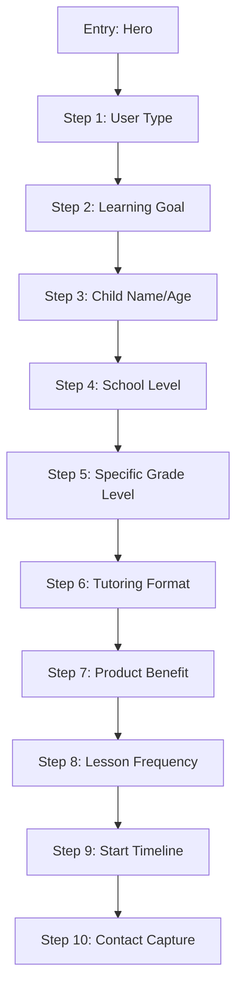
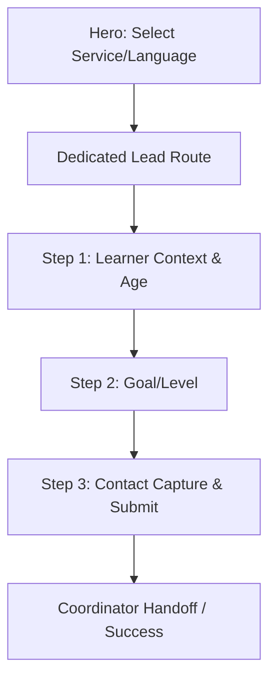

# UI-WEB-001A — GoStudent Hero Lead Journey Browser Audit & SPM Adaptation

## 1. Executive Summary
This document consolidates the findings from the interactive browser inspection of the GoStudent free trial funnel and compares it against the current Success Path Mentors (SPM) registration flow. It provides an authoritative blueprint for the future SPM hero-to-lead architecture, emphasizing a staged, low-friction entry that progressively qualifies the user before requesting contact details.

## 2. Browser Inspection Method
Evidence was gathered via interactive, rendered-page inspection using the Antigravity Browser Tool on the live GoStudent German site (`https://www.gostudent.org/de-de/`). The inspection stepped through the trial booking wizard sequentially, capturing UI states and branching logic without submitting any real personal information or triggering irreversible external actions. The Antigravity Browser subagent succeeded on the third attempt; Playwright fallback was not required.

## 3. Browser Evidence Inventory
**Evidence Source:** ANTIGRAVITY BROWSER OBSERVATION
Screenshots captured and stored in the session scratch directory as review evidence:
- Step 0: Initial Screen
- Step 1: User Type / Grade
- Step 2: Subject Selection
- Step 3: Tutoring Format
- Step 4: Motivation / Value Prop
- Step 5: Lesson Frequency
- Step 6: Start Timeline
- Step 7: Contact Information (Stopped)

*Note: These screenshots are temporary review artifacts and must not be committed to the repository or used as production assets.*

## 4. GoStudent Journey Map
**OBSERVED GoStudent Journey (Interactive)**

**PROPOSED SPM Journey (NOT IMPLEMENTED)**

## 5. Screen-by-Screen Observations

| Step | Observed Screen | Question/Purpose | Interaction Type | Evidence | Notes |
|---|---|---|---|---|---|
| 1 | User Type | "Was trifft am ehesten auf dich zu?" | 3 Choice Cards | ANTIGRAVITY BROWSER | Parents, Students, Adults. |
| 2 | Learning Goal | "Was ist das wichtigste Lernziel..." | 4 Choice Cards | ANTIGRAVITY BROWSER | Includes injected social proof. |
| 3 | Child Details | "Lass uns deine Lernreise personalisieren!" | Text Inputs | ANTIGRAVITY BROWSER | Name and Age. Has "Skip" option. |
| 4 | School Level | "In welcher Schulstufe ist [Name] aktuell?" | 6 Choice Cards | ANTIGRAVITY BROWSER | Name dynamically injected. |
| 5 | Grade Level | "Und in welcher Jahrgangsstufe ist [Name]..." | 4 Choice Cards | ANTIGRAVITY BROWSER | Choices filtered by previous step. |
| 6 | Tutoring Format | "Welches Nachhilfeformat wünschst du dir?" | 3 Choice Cards | ANTIGRAVITY BROWSER | Online, In-person, Not sure. |
| 7 | Product Benefit | Motivation Chart | 1 CTA Button ("Weiter") | ANTIGRAVITY BROWSER | Value proposition reinforcement. |
| 8 | Lesson Frequency | "Wie oft möchtest du Unterricht haben?" | 4 Choice Cards | ANTIGRAVITY BROWSER | Emphasizes "Twice a week". |
| 9 | Start Timeline | "Wann möchtest du starten?" | 4 Choice Cards | ANTIGRAVITY BROWSER | Includes parent testimonial. |
| 10 | Contact Info | "Lass uns jetzt deine kostenlose Probeeinheit planen" | Form Fields | ANTIGRAVITY BROWSER | Name, Email, Phone, Opt-in. Stopped. |

## 6. Observed Behavior
- **OBSERVED:** Progress tracking is continuous via a horizontal bar.
- **OBSERVED:** Dynamic text injection (e.g., using the child's name in subsequent questions).
- **OBSERVED:** Social proof is integrated directly into the selection cards, not just isolated in sidebars.
- **OBSERVED:** State is persisted in the URL query string (`flow=leaf`, `reachOutVia=Web`, `subject=...`).
- **OBSERVED:** Clicking a choice card automatically advances to the next step without requiring a "Next" click.

## 7. Inferred Behavior
- **INFERRED:** Options for Grade Level are dynamically scoped based on the School Level selection.
- **INFERRED:** The heavy use of intermediate steps acts to increase sunk-cost investment before asking for PII (phone/email).

## 8. Not Verified
- **NOT VERIFIED:** Final submission behavior, SMS/Email OTP verification, calendar booking flow.
- **NOT VERIFIED:** Mobile sticky CTA behaviors and virtual keyboard overlay constraints during field input.

## 9. Progressive Disclosure Analysis
GoStudent heavily utilizes progressive disclosure. Instead of a single intimidating form, users answer one simple question per screen. High-friction data (Phone, Email) is delayed until Step 10, maximizing completion rates for initial intent.

## 10. Hero Entry Analysis
The GoStudent entry relies on a single clear CTA ("Kostenlose Probestunde") or a short dropdown that routes the user to a dedicated full-screen funnel, removing landing page distractions during the critical conversion path.

## 11. URL / Session Context Analysis
URL parameters act as a lightweight state machine (e.g., `learningProfile=Parent`, `stb_kid_name=Max`). This enables back-button resilience, bookmarking, and abandonment recovery without relying exclusively on cookies or local storage.

## 12. Current SPM Journey
The current SPM Hero `src/components/sections/home/hero.tsx` features an inline `EnrollmentCard` containing 9 fields spread across 3 steps.
1. Entry: Direct inline interaction in the Hero section.
2. Step 1: Contact Details (Name, WhatsApp, Email).
3. Step 2: Student Age, Country, Province.
4. Step 3: Subjects, Teaching Language, Notes.
5. Submission → Simulated Success State.

## 13. Current SPM Field Inventory
- **Step 1:**
  - `parentName` (Text, Required)
  - `whatsapp` (Tel, Required)
  - `email` (Email, Required, Validated format)
- **Step 2:**
  - `studentAge` (Number, Required, 3-99)
  - `country` (Choice, Required, USA/Canada)
  - `province` (Text, Optional)
- **Step 3:**
  - `subjects` (Multi-choice, Required)
  - `teachingLanguage` (Choice, Required, EN/FR)
  - `notes` (Textarea, Optional)
**Current Friction:** Asks for PII (Step 1) before qualification. No OTP verification. 9 total inputs requested before creating a lead. Country choices lack Germany.

## 14. Current SPM Persistence / Success-State Review
**Status:** CONFIRMED.
**Explanation:** Inspection of `src/components/sections/home/enrollment-card.tsx` (lines 136-161) confirms the statement "Simulated enrollment success without persistence". The `handleSubmit` function calls a 900ms `setTimeout` to mimic network latency, sets `status` to `success`, and renders a success UI. No actual HTTP POST request is made to a backend, and the data is lost upon refresh.

## 15. Current SPM vs GoStudent vs Recommended SPM

| Dimension | Current SPM | Observed GoStudent | Recommended Future SPM |
|---|---|---|---|
| **Entry mechanism** | Inline multi-step form | Single CTA → Leaf route | First question inline → Modal/Dedicated Route |
| **First question** | Name / Email / WhatsApp | User Type (Parent/Student) | Service Selection (Language) |
| **Number of steps** | 3 steps | 10+ micro-steps | 3-4 progressive steps |
| **Questions per screen** | 3 (High density) | 1 (Low density) | 1-2 (Balanced density) |
| **Contact capture timing**| Step 1 (Early) | Step 10 (Late) | Final Step (Late) |
| **Phone** | Required (WhatsApp) | Required (Handy) | Required (WhatsApp/Phone) |
| **Email** | Required | Required | Required |
| **OTP** | None | Not Verified | Not initially required (Coordinator validates) |
| **Confirmation** | Fake success UI | Not Verified | Real Lead API Creation |
| **Mobile friction** | High (Scrolling inline form) | Low (Auto-advance cards) | Low (Auto-advance choices) |

## 16. Recommended First Hero Interaction
**Recommendation:** Service Selection (e.g., "Which language do you want to learn?").
**Explanation:** This is an extremely low-friction question that immediately communicates SPM's core offering (Languages). It qualifies the user instantly, works universally across markets, and establishes the "intent" for analytics before any other interaction.

## 17. Proposed SPM Step Sequence
**Step 1: Service Selection (Hero)**
- Purpose: Intent capture.
- Question: "Which language do you want to learn?" (German/English/Arabic/French)
- UI: Large selection cards inline in the Hero.

**Step 2: Learner Context (Dedicated Flow / Modal)**
- Purpose: Contextualize the lead.
- Question: "Who is the tutoring for and what is their current level?"
- UI: Learner Type (Self/Child) and Age/Grade dropdown.

**Step 3: Tutoring Goal**
- Purpose: Empathy and matching.
- Question: "What is your main goal?"
- UI: Options (Improve grades, Confidence, Conversational, Other).

**Step 4: Contact & Submit**
- Purpose: Lead creation.
- Fields: Name, WhatsApp/Phone, Email (All required).
- UI: Standard inputs with clear privacy messaging and primary "Request Free Trial" CTA.

## 18. Recommended Number of Steps
We recommend **3-4 steps** (including the Hero intent click). This provides the psychological commitment benefit of progressive disclosure without the excessive fatigue of GoStudent's 10-step sequence.

## 19. Hero Embedding Decision
**Recommendation:** C. First question in Hero → dedicated lead-flow route.
- Conversion: 4
- Mobile UX: 5
- Accessibility: 5
- Browser back behavior: 5
- Analytics: 5
- SEO: 5
- Performance: 3
- Maintainability: 5
- Multilingual support: 4
- Abandonment recovery: 5
**Score:** 46/50
**Explanation:** A dedicated route (`/trial` or `/booking`) allows full focus, excellent browser history handling, easy deep-linking, and perfect tracking. It removes the constraints of fitting a form inside the hero section on mobile devices.

## 20. Shared Cross-Market Architecture
A shared architecture is crucial for maintainability.
`SharedHeroLeadJourney` should orchestrate the flow.
- **Shared Logic:** Sequence controller, validation rules, state management, and back/next mechanics.
- **Market Config:** Defines which services are available (e.g., NA vs Germany) and default country codes for phone inputs.
- **Locale Translations:** UI copy, button text, error messages (managed via `next-intl`).
- **Submission Adapter:** Transforms the unified frontend state into the specific backend CRM payload.
- **UI Layer:** Dumb presentational components (Cards, Inputs, Progress Bar).

## 21. Germany Configuration
- **UI Locales:** German, English, Arabic.
- **Tutoring Services:** German, English, Arabic, French.
- *Note:* French is a core tutoring service for the Germany market.

## 22. North America Configuration
Do not assume Germany's service set. North America configurations must be explicitly defined in `MarketConfig` to prevent accidental service bleed.

## 23. UI Locale vs Tutoring Service Distinction
The language the user navigates the website in (UI Locale) is strictly independent of the language they wish to learn (Tutoring Service). A user browsing in Arabic may request German tutoring.

## 24. RTL / Arabic Requirements
- **Document Direction:** `dir="rtl"` applied at the layout level.
- **Field Alignment:** Text inputs right-aligned, labels on the right.
- **Next/Back Order:** Next button on the left, Back button on the right.
- **Phone/Email Isolation:** Phone and Email inputs forced to `dir="ltr"` to prevent mixed-script corruption.
- **Directional Icons:** Arrows (e.g., `ArrowRight`) must be flipped horizontally (`rtl:-scale-x-100`).

## 25. Backend Submission Decision
**Recommendation:** C. Staged lead → coordination → full registration.
**Scores:**
- Conversion friction: 5 (Excellent, very low friction)
- Operations workflow: 5 (Allows human touch)
- Incomplete leads: 4
- Duplicate handling: 4
- CRM readiness: 5
**Explanation:** By submitting a lightweight lead (intent + contact), we maximize conversion. The complex LMS registration happens *after* the human coordinator confirms the match, removing the burden from the public user.

## 26. Analytics / Attribution Model
Track first-touch (session cookie) and current-touch (URL params).
Required SPM-owned fields:
`market`, `locale`, `selected_service`, `source`, `utm_source`, `utm_medium`, `utm_campaign`, `utm_content`, `landing_page`, `referrer`, `session_id`, `timestamp`.

## 27. Trust / Privacy Requirements
- **WhatsApp display:** +49 1512 3974353
- **WhatsApp digits:** 4915123974353
- **Official Europe email:** europe@successpathmentors.net
*Rule:* Only publish SAFE TO USE IF CURRENTLY TRUE claims. "1-to-1 tutoring" is safe. "95% improve grades" requires business evidence and must not be copied.

## 28. Open Business Questions
- What is the exact guaranteed response time for a trial request?
- What are the precise age eligibility limits for Germany?

## 29. Items Requiring Validation Before Implementation
- Operations team confirmation of the Staged Lead CRM workflow.
- Legal approval of the privacy check-box language.

## 30. UI-WEB-002 Handoff Requirements
UI-WEB-002 must strictly implement the `PROPOSED SPM Journey` defined in Section 4 and 17. It must utilize the `SharedHeroLeadJourney` architecture and adhere to all RTL/Analytics requirements. Do not proceed with UI-WEB-002 implementation until this document is approved.

STATUS: READY FOR EXTERNAL REVIEW
